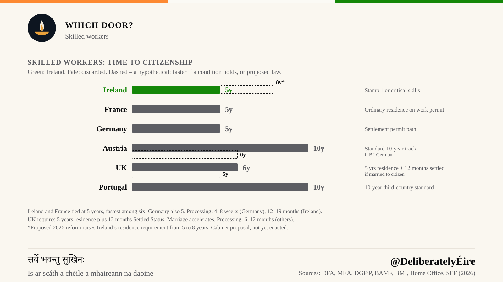
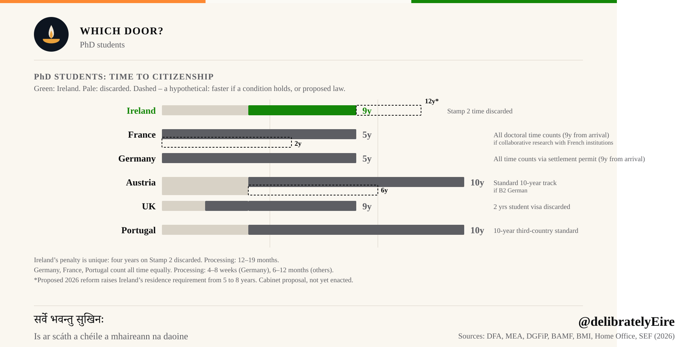
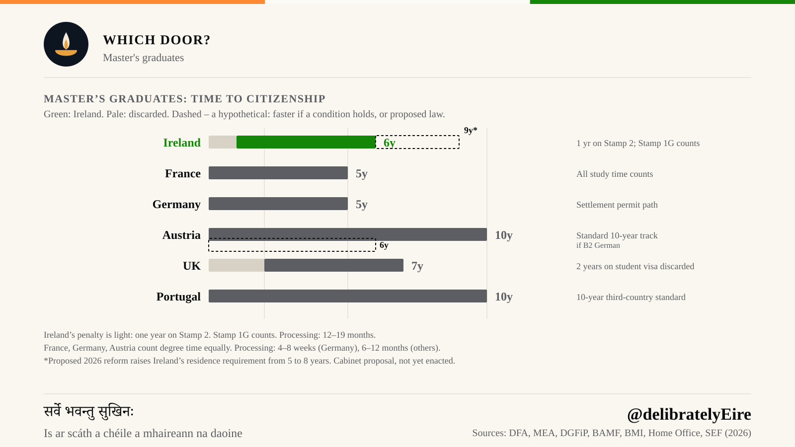
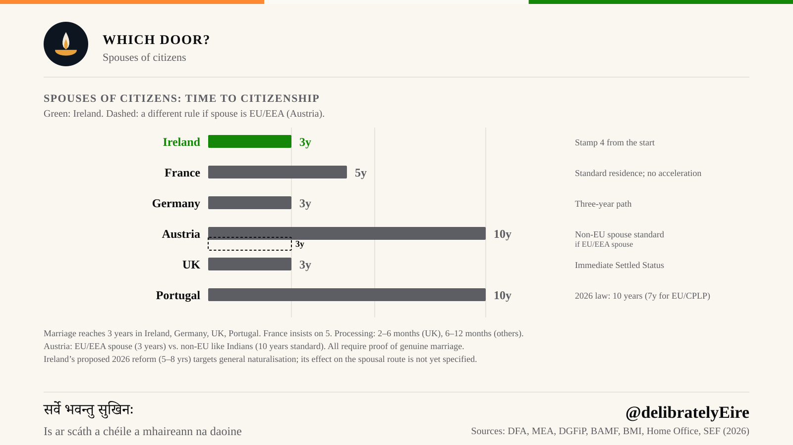

Two people land at Dublin Airport in the same week. One holds a critical skills employment permit. The other holds a letter of offer from a university. Five years later, the worker can post a naturalisation application. The researcher cannot, and if the doctorate ran the usual four years, has four more years to wait.

Neither of them did anything wrong. The gap comes from a single administrative rule about which years of residence Ireland agrees to count, and it is the most consequential sentence in Irish immigration law that almost nobody reads before they arrive.

Every figure in this article is also provisional. In September 2026 the Irish Cabinet approved a proposal to raise the general residence requirement from five years to eight. That is the dashed bar on each chart below. It has not been enacted. If it is, it adds three years to almost every number here, and changes none of the reasoning behind them.

> **Key Takeaways**
> - For skilled workers, Ireland asks five years, tied with France as the fastest of the six countries compared, and matched by Germany.
> - Years spent on Stamp 2, the student permission, do not count toward naturalisation. Stamp 1G, the graduate permission, does.
> - That single exclusion turns five years into six for a master's graduate and nine for a PhD researcher.
> - Spouses of Irish citizens reach three years, Ireland's fastest door and among the fastest in Europe.
> - Ireland's processing time, twelve to nineteen months, is the slowest on every chart here.
> - A Cabinet proposal in September 2026 would raise the general requirement from five years to eight. It is not law.

## Workers: The Baseline Clock

For someone who arrives on an employment permit, whether Stamp 1 or a critical skills permit, Ireland asks five years. That is the fastest figure on the chart, tied with France, which counts ordinary residence on a work permit at the same five. Germany matches it through the settlement permit path. The United Kingdom asks six, structured as five years' residence plus twelve months holding settled status, dropping to five for someone married to a British citizen. Austria and Portugal both ask ten, with Austria falling to six for applicants who reach B2 German.

The dashed bar is the warning. Under the 2026 proposal that five becomes eight, which would drop Ireland from the front of this group to a position of its own: slower than the five-year cluster, still short of the ten.

So a worker comparing Dublin against Paris, Berlin, London, Vienna and Lisbon finds Ireland in the leading group, not trailing it. For now. That is worth saying plainly, because the rest of this article is about a penalty, and the penalty is narrow. It does not apply to the person who came here to work.

Where Ireland does lose ground is after the application goes in. An Irish naturalisation decision takes twelve to nineteen months. A German one takes four to eight weeks. The remaining four sit between six and twelve. Ireland asks for the same five years as Germany, then takes roughly ten times as long to answer, so the real distance between the two is closer to a year than the bars suggest.

## PhD Researchers: Nine Years

A doctorate in Ireland typically runs four years on Stamp 2. Under the reckonable-residence rule, all four are discarded. The researcher then needs five countable years after the doctorate ends: nine years in total from arrival to eligibility.

France counts all doctoral time and asks five. Germany counts it too, via the settlement permit path, and asks five. The UK asks seven, discarding two years of student visa. Austria asks ten, or six with B2 German. Portugal asks ten under its standard third-country track.

The dashed bar carries that nine to twelve. A researcher starting a doctorate in Dublin today, if the proposal passes before they qualify, would be looking at twelve years from arrival to eligibility, more than Austria's standard ten.

Ireland is the only country here where the discarded period runs to four full years. The chart calls the penalty unique, and the arithmetic bears that out: nowhere else does the deepest qualification a university can award cost the holder the most time. The same twelve-to-nineteen-month processing wait then sits on top of it.

There is a tension here worth naming plainly. Ireland recruits doctoral researchers deliberately: through funded programmes, through its universities, through a national research strategy that treats them as an asset. The reckonable-residence rule, written for a different purpose and long predating that strategy, then sets those same years aside. The two policies were not designed against one another. They simply have not been reconciled.

## Master's Graduates: Six Years

The master's route shows the same rule at a smaller scale. A taught master's is usually one year on Stamp 2. That year is discarded; the Stamp 1G graduate year that follows counts in full. Five countable years plus one discarded year comes to six.

The dashed bar takes that six to nine. Against the comparators the current figure is a middling result rather than a punishing one. France and Germany ask five. The UK asks seven, discarding two years of student visa, so Ireland is actually a year faster than Britain for this group. Austria and Portugal ask ten.

The chart describes Ireland's penalty here as light, and that is the right word. The lesson is not that studying in Ireland is a mistake. It is that the cost scales directly with how long you study, which is a strange thing for an education system to charge for.

## Spouses of Citizens: Three Years

This is Ireland's fastest door, and it is genuinely fast. Three years, with Stamp 4 permission granted from the start, meaning the residence that counts begins immediately rather than after some qualifying period.

Germany asks three. The UK asks three, with immediate settled status and the quickest processing on any of these charts at two to six months. Portugal asks three under its 2026 law. France asks five and offers no acceleration for marriage at all, the one comparator clearly slower than Ireland here.

Austria splits. A spouse of an EU or EEA citizen reaches three years. A non-EU spouse (the chart names Indian nationals specifically) faces the standard ten. For couples where one partner holds a third-country passport, that is a seven-year difference decided by nationality rather than by anything the couple did.

This is also the one route the proposal leaves ambiguous. The spouse chart carries no dashed bar for Ireland, and notes only that the 2026 reform targets general naturalisation, and that its effect on the spousal route is not yet specified. Three years may well hold. The proposal, as published, does not address it either way.

All six jurisdictions require proof of a genuine marriage. Nobody is waving anyone through.

## The 2026 Proposal: Not Yet Law

In September 2026, the Irish Cabinet approved a proposal to raise the general residence requirement from five years to eight. Every chart here marks the consequence with a dashed bar: the worker's five becomes eight, the master's graduate's six becomes nine, the PhD researcher's nine becomes twelve.

Three things are worth holding onto. It is a Cabinet proposal, not enacted legislation, and the charts label it as such. Its effect on the spousal route has not been specified, so the three-year path may or may not move. And nothing about it changes the reckonable-residence rule itself. An eight-year base with Stamp 2 still excluded produces the same shape of unfairness, three years further out.

It would also cost Ireland the position it currently holds. At five years the country is tied with France at the front of this group. At eight it would sit alone between the five-year cluster and the ten-year one, having given up the clearest advantage it has.

## Which Door Is Yours

If you are arriving on an employment permit, your clock is five years, and Ireland is among the best options in this comparison, provided you budget for the processing wait at the end.

If you are arriving to study, the question to ask before accepting a place is how many of those years will sit on Stamp 2. One year costs you one year. Four years cost you four. The Stamp 1G graduate permission that follows does count, so switching into work promptly protects the time you have.

If you are marrying an Irish citizen, three years is among the best terms available anywhere here.

And if you are choosing between countries for doctoral work specifically, the comparison is stark enough to name plainly: France and Germany will count every year of your research toward citizenship. Ireland will count none of them.

## Conclusion

The people affected by the Stamp 2 exclusion are not people who tried to shortcut anything. They are researchers, graduates and the spouses who moved with them. They paid fees, filed renewals, and registered with immigration every year, and found later that those years did not count toward naturalisation.

Ireland's worker pathway is genuinely competitive and its spousal pathway is generous. Both are worth defending. Aligning the study-year rule with them would not require giving up either, only that the clock count the years a doctoral researcher in Galway was, by every other measure, already living here.

*Figures throughout are drawn from the four comparison charts above. Ireland's 2026 reform is a Cabinet proposal rather than enacted law, and the charts mark that uncertainty rather than resolving it.*
