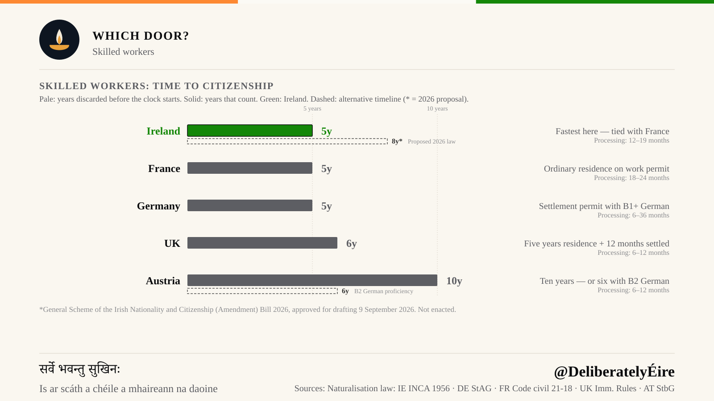
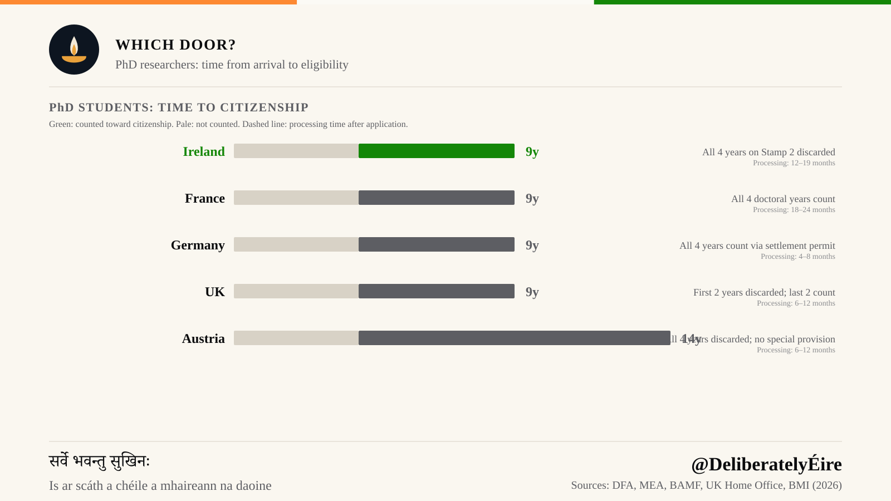
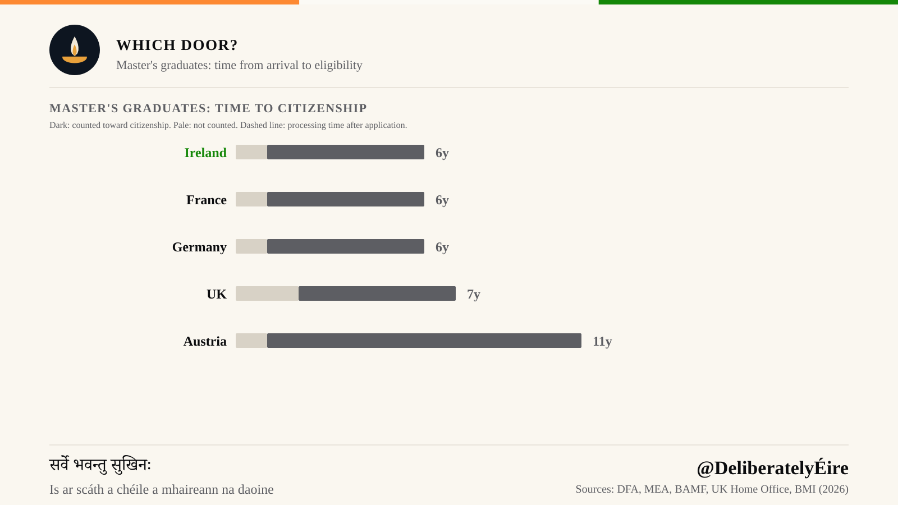
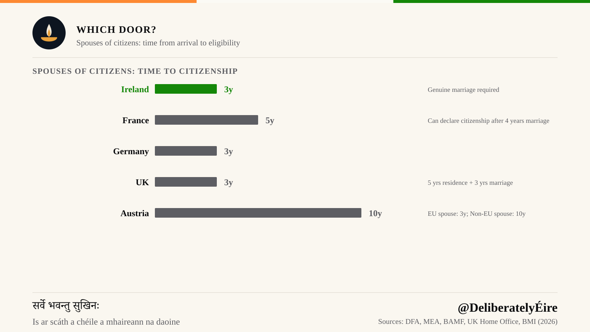

Two people land at Dublin Airport in the same week. One holds a critical skills employment permit. The other holds a letter of offer from a university. Five years later, the worker can post a naturalisation application. The researcher cannot, and if the doctorate ran the usual four years, has four more years to wait.

Neither of them did anything wrong. The gap comes from a single administrative rule about which years of residence Ireland agrees to count, and it is the most consequential sentence in Irish immigration law that almost nobody reads before they arrive.

Every figure in this article is also provisional. In September 2026 the Irish Cabinet approved a proposal to raise the general residence requirement from five years to eight. That is the dashed bar on each chart below. It has not been enacted. If it is, it adds three years to almost every number here, and changes none of the reasoning behind them.

> **Key Takeaways**
> - For skilled workers, Ireland asks five years, tied with France as the fastest of the five countries compared, and matched by Germany.
> - Years spent on Stamp 2, the student permission, do not count toward naturalisation. Stamp 1G, the graduate permission, does. Applicants need 1,825 days (approximately 5 years) of reckonable residence.
> - That single exclusion turns five years into six for a master's graduate and nine for a PhD researcher.
> - Spouses of Irish citizens reach three years, Ireland's fastest door and tied with Germany as the fastest here.
> - Ireland's decision takes twelve to nineteen months, slower than the UK or Austria. Only France, and the slowest German municipalities, take longer.
> - A Cabinet proposal in September 2026 would raise the general requirement from five years to eight. It is not law.

## Workers: The Baseline Clock

For someone who arrives on an employment permit, whether Stamp 1 or a critical skills permit, Ireland asks five years. Under the Irish Nationality and Citizenship Act 1956 (as amended), that means one year of continuous reckonable residence immediately before applying, plus four more years within the preceding eight ([Immigration Service Delivery](https://www.irishimmigration.ie/how-to-become-a-citizen/become-an-irish-citizen-by-naturalisation/)). That is the fastest figure on the chart, tied with France, which counts ordinary residence on a work permit at the same five. Germany matches it through the settlement permit path. The standard requirement was reduced from eight years to five years in the 2024 citizenship reform, in force since 27 June 2024, and requires _"sufficient knowledge of German, at least at level B1"_ and _"sufficient knowledge of the legal system, society and way of life in Germany"_ ([Federal Government](https://www.bundesregierung.de/breg-en/news/federal-cabinet-naturalisation-2351972)). The [United Kingdom](https://www.gov.uk/british-citizenship) asks six, structured as five years' residence plus twelve months holding settled status, dropping to five for someone married to a British citizen. Austria asks ten, falling to six for applicants who reach [B2 German](https://www.bmi.gv.at/en/index.html).

Sources: [Ireland Critical Skills Employment Permit](https://www.citizensinformation.ie/en/moving-country/working-in-ireland/employment-permits/green-card-permits/) · [German Settlement Permit](https://www.bamf.de/EN/Themen/Integration/ZugewanderteTeilnehmende/Einbuergerung/einbuergerung.html) · [Austria Citizenship Requirements](https://www.migration.gv.at/en/living-and-working-in-austria/integration-and-citizenship/citizenship/)

The dashed bar is the warning. Under the 2026 proposal that five becomes eight, which would drop Ireland from the front of this group to a position of its own: slower than the five-year cluster, still short of the ten.

So a worker comparing Dublin against Paris, Berlin, London and Vienna finds Ireland in the leading group, not trailing it. For now. That is worth saying plainly, because the rest of this article is about a penalty, and the penalty is narrow. It does not apply to the person who came here to work.

Where Ireland does lose ground is after the application goes in. A naturalisation decision takes twelve to nineteen months, a figure published by [Immigration Service Delivery](https://www.irishimmigration.ie/how-to-become-a-citizen/become-an-irish-citizen-by-naturalisation/) in the Department of Justice rather than fixed by statute. German timelines are set locally and vary more than any other country here: there is no single federal figure, and civitas., a private naturalisation service, puts the _"authority review phase"_ at _"6 to 36 months depending on the municipality and case complexity"_ ([civitas. Processing Timeline](https://einbuergerungsservice.de/en/ablauf)). The UK and Austria sit between six and twelve months; France between eighteen and twenty-four. Ireland asks the same five years as Germany but answers more slowly than the UK or Austria, so the real distance widens once the application is filed.

## PhD Researchers: Nine Years

A doctorate in Ireland typically runs four years on Stamp 2. Under the reckonable-residence rule, all four are discarded. The researcher then needs five countable years after the doctorate ends: nine years in total from arrival to eligibility.

France offers a two-year path to graduates of its own institutions. Article 21-18 of the Code civil cuts the usual five-year qualifying period to two for anyone who has completed two years of higher education toward a French diploma ([Legifrance](https://www.legifrance.gouv.fr/codes/article_lc/LEGIARTI000024197095)); a doctorate clears that comfortably. Germany counts doctoral time through the settlement permit route: section 18c(3) of the Residence Act gives highly qualified scientists an immediate settlement permit with no prior waiting period ([Aufenthaltsgesetz §18c](https://www.gesetze-im-internet.de/aufenthg_2004/__18c.html)), and standard naturalisation then asks five years. The UK asks ten: student years count toward the five-year residence test but build no entitlement to settlement, so the clock to indefinite leave to remain only starts on a work route, and naturalisation follows twelve months after that. Austria asks ten, or six with B2 German ([Austria Citizenship](https://www.migration.gv.at/en/living-and-working-in-austria/integration-and-citizenship/citizenship/)).

The dashed bar carries that nine to twelve. A researcher starting a doctorate in Dublin today, if the proposal passes before they qualify, would be looking at twelve years from arrival to eligibility, more than Austria's standard ten.

Ireland and the UK are the two countries here where a doctorate costs its holder four years, and they get there by different routes: Ireland strikes the years from the reckonable count outright, while Britain lets them count for residence but not for settlement. France and Germany cost a researcher nothing. The same twelve-to-nineteen-month processing wait then sits on top of it.

There is a tension here worth naming plainly. Ireland recruits doctoral researchers deliberately: through funded programmes, through its universities, through a national research strategy that treats them as an asset. The reckonable-residence rule, written for a different purpose and long predating that strategy, then sets those same years aside. The two policies were not designed against one another. They simply have not been reconciled.

## Master's Graduates: Six Years

The master's route shows the same rule at a smaller scale. A taught master's is usually one year on Stamp 2. That year is discarded; the Stamp 1G graduate year that follows counts in full. Five countable years plus one discarded year comes to six.

The dashed bar takes that six to nine. Against the comparators the current figure is a middling result rather than a punishing one. France and Germany both shorten the road for their own graduates. Alongside the residence requirement France asks for B2 French, a pass in the civics examination, stable income and a clean record ([service-public.gouv.fr](https://www.service-public.gouv.fr/particuliers/vosdroits/F2213)), and decisions take eighteen to twenty-four months. The UK asks seven, for the same reason it asks ten of a doctoral researcher, so Ireland is a year faster than Britain for this group. Austria asks ten ([Austria Citizenship](https://www.migration.gv.at/en/living-and-working-in-austria/integration-and-citizenship/citizenship/)).

Ireland's penalty here is light, and that is the right word for it. The lesson is not that studying in Ireland is a mistake. It is that the cost scales directly with how long you study, which is a strange thing for an education system to charge for.

## Spouses of Citizens: Three Years

This is Ireland's fastest door, and it is genuinely fast. Three years, with Stamp 4 permission granted from the start, meaning the residence that counts begins immediately rather than after some qualifying period.

Germany asks three ([BAMF Naturalisation](https://www.bamf.de/EN/Themen/Integration/ZugewanderteTeilnehmende/Einbuergerung/einbuergerung.html)). The UK requires five years of continuous residence on a partner visa before indefinite leave to remain becomes available ([UK Home Office](https://www.gov.uk/indefinite-leave-to-remain)). Applying for naturalisation as a spouse requires three years' residence, but the applicant must already hold settled status on the day they apply, and the partner route reaches settlement at five years. Five years is the real figure. France requires five years but offers an accelerated path: spouses of French citizens can acquire nationality by declaration after four years of marriage, provided they have resided in France. Austria grants early naturalisation at six years to the spouse of an Austrian citizen, provided the marriage and a common household have both lasted five years, against a general requirement of ten ([Austria Citizenship](https://www.migration.gv.at/en/living-and-working-in-austria/integration-and-citizenship/citizenship/)).

Ireland's spousal route is the one the Cabinet proposal leaves ambiguous. The 2026 reform targets general naturalisation, and its effect on the spousal path is not yet specified. Three years may well hold. The proposal, as published, does not address it either way.

All five jurisdictions require proof of a genuine marriage. Nobody is waving anyone through.

## The 2026 Proposal: Not Yet Law

In September 2026, the Irish Cabinet approved a proposal to raise the general residence requirement from five years to eight. Every chart here marks the consequence with a dashed bar: the worker's five becomes eight, the master's graduate's six becomes nine, the PhD researcher's nine becomes twelve.

Three things are worth holding onto. It is a Cabinet proposal, not enacted legislation, and the charts label it as such. Its effect on the spousal route has not been specified, so the three-year path may or may not move. And nothing about it changes the reckonable-residence rule itself. An eight-year base with Stamp 2 still excluded produces the same shape of unfairness, three years further out.

It would also cost Ireland the position it currently holds. At five years the country is tied with France at the front of this group. At eight it would sit alone between the five-year cluster and the ten-year one, having given up the clearest advantage it has.

## Which Door Is Yours

If you are arriving on an employment permit, your clock is five years, and Ireland is among the best options in this comparison, provided you budget for the processing wait at the end.

If you are arriving to study, the question to ask before accepting a place is how many of those years will sit on Stamp 2. One year costs you one year. Four years cost you four. The Stamp 1G graduate permission that follows does count, so switching into work promptly protects the time you have.

If you are marrying an Irish citizen, three years is among the best terms available anywhere here.

And if you are choosing between countries for doctoral work specifically, the comparison is stark enough to name plainly: France and Germany will count every year of your research toward citizenship. Ireland will count none of them.

## Conclusion

The people affected by the Stamp 2 exclusion are not people who tried to shortcut anything. They are researchers, graduates and the spouses who moved with them. They paid fees, filed renewals, and registered with immigration every year, and found later that those years did not count toward naturalisation.

Ireland's worker pathway is genuinely competitive and its spousal pathway is generous. Both are worth defending. Aligning the study-year rule with them would not require giving up either, only that the clock count the years a doctoral researcher in Galway was, by every other measure, already living here.

---

## Data Sources

Chart data drawn from:

- **Ireland**: [Immigration Service Delivery](https://www.irishimmigration.ie/how-to-become-a-citizen/become-an-irish-citizen-by-naturalisation/), [Irish Nationality and Citizenship Act 1956](https://www.irishstatutebook.ie/eli/1956/act/26/enacted/en/print.html), [gov.ie — Amendment Bill 2026](https://www.gov.ie/en/department-of-justice-home-affairs-and-migration/press-releases/government-approval-secured-for-the-priority-drafting-of-the-irish-nationality-and-citizenship-amendment-bill-2026/)
- **France**: [Code civil arts. 21-17 and 21-18 (Legifrance)](https://www.legifrance.gouv.fr/codes/article_lc/LEGIARTI000024197095), [service-public.gouv.fr](https://www.service-public.gouv.fr/particuliers/vosdroits/F2213)
- **Germany**: [BAMF](https://www.bamf.de), [Federal Government Naturalisation Reform](https://www.bundesregierung.de)
- **United Kingdom**: [Citizenship with settled status](https://www.gov.uk/apply-citizenship-indefinite-leave-to-remain), [Indefinite leave to remain](https://www.gov.uk/indefinite-leave-to-remain)
- **Austria**: [oesterreich.gv.at — grant after ten years](https://www.oesterreich.gv.at/de/themen/menschen_aus_anderen_staaten/staatsbuergerschaft/1/Verleihung-nach-zehn-Jahren), [early grant after six years](https://www.oesterreich.gv.at/de/themen/menschen_aus_anderen_staaten/staatsbuergerschaft/1/Vorzeitige-Verleihung-nach-sechs-Jahren)

Processing times as published in September 2026; Germany sets them locally and has no single national figure. All timelines assume continuous residence and fulfilment of ancillary requirements (language proficiency, civic knowledge, genuine residence, etc.).

*Figures throughout are drawn from the comparison charts above. Ireland's 2026 reform is a Cabinet proposal rather than enacted law, and the charts mark that uncertainty rather than resolving it. More writing on Ireland and India is on the [blog](/blog).*
