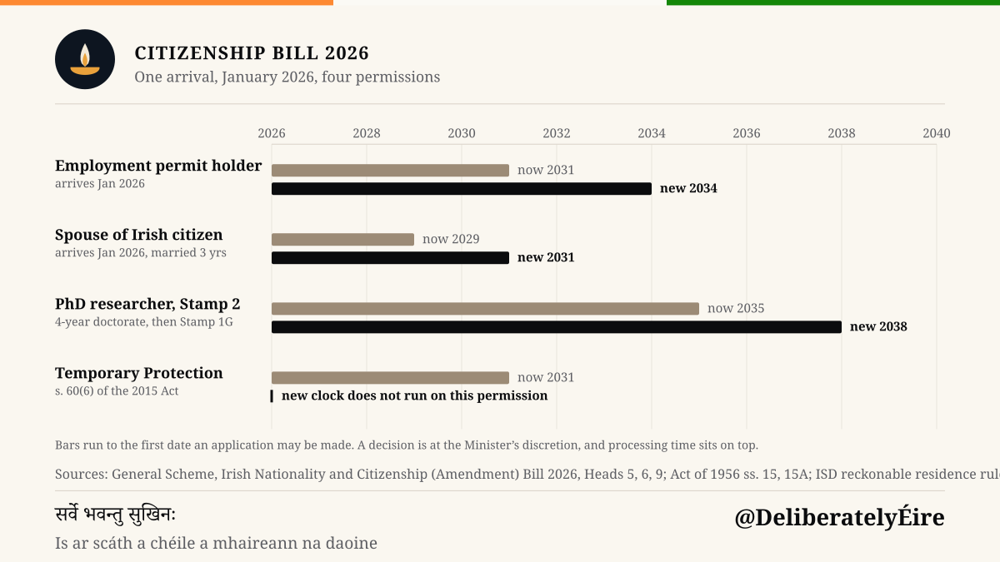
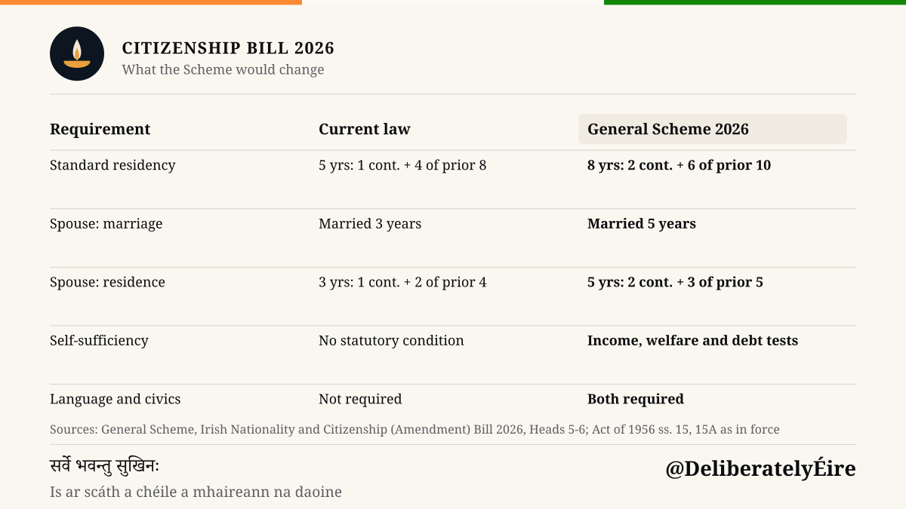
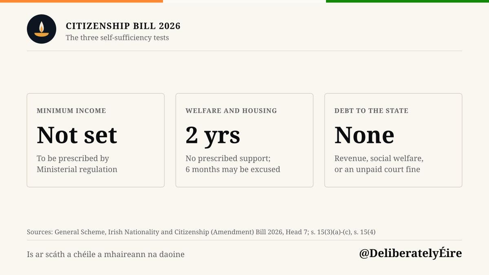
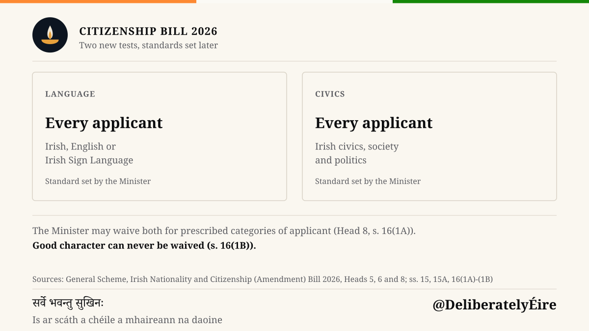
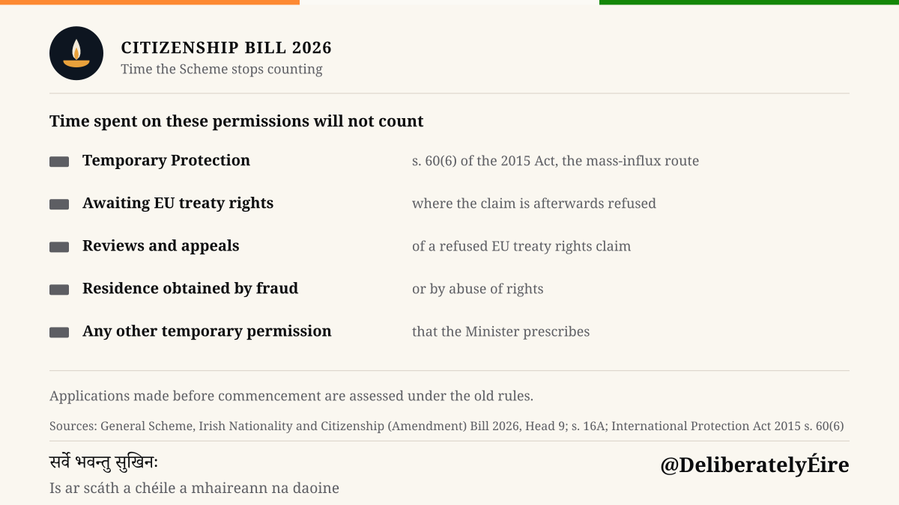
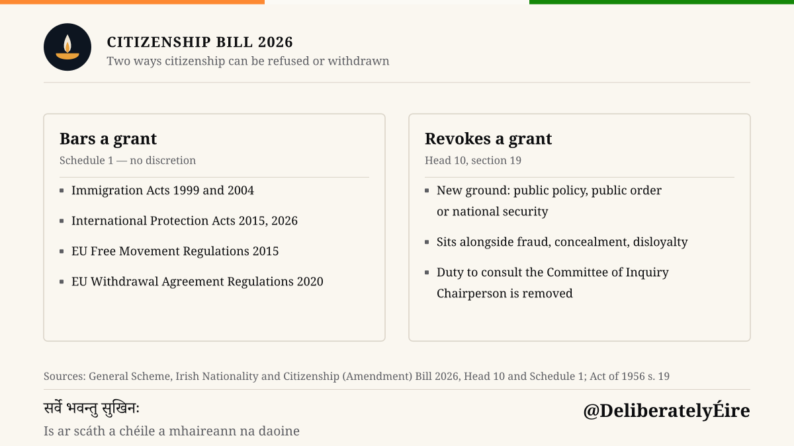
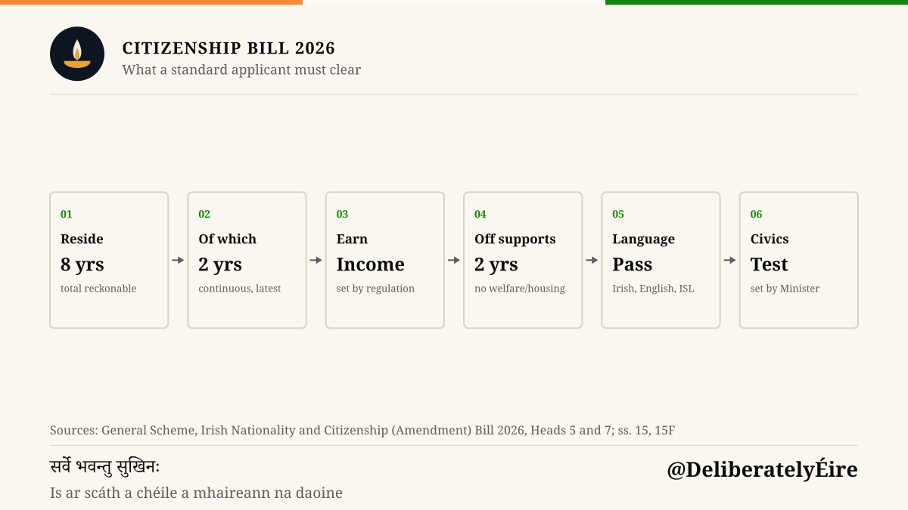
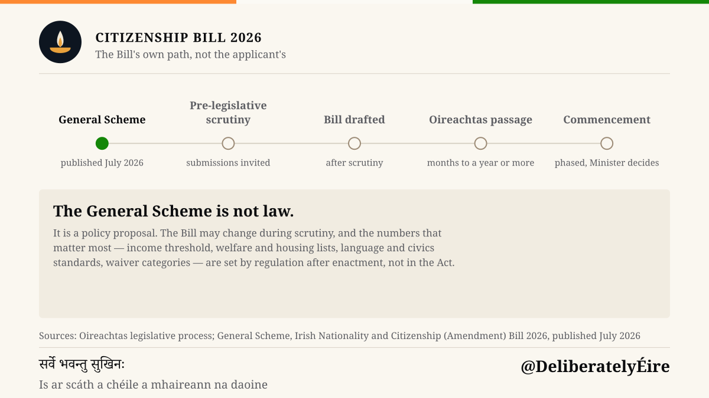

A plain-language guide to the General Scheme published by the Department of Justice, Home Affairs and Migration

## The Headline

The Irish government has published the **General Scheme of the Irish Nationality and Citizenship (Amendment) Bill 2026** — a legislative blueprint that, if enacted, would represent the most significant tightening of naturalisation requirements in decades.

The stated aim: ensure that citizenship reflects "steady economic and social integration" and a "meaningful long-term connection" to Ireland. The practical effect: longer waits, higher bars, and new tests for anyone seeking to become Irish.

## What It Means for One Arrival

Take someone who lands in Dublin in **January 2026**. The permission in her passport, not her circumstances, decides when she can first post a naturalisation application.

The bars run to the first date an application may be *made*. A grant is at the Minister's discretion, and processing time sits on top of every bar here.

- **On an employment permit**, she reaches five years of reckonable residence in **2031**. Under the Scheme she needs eight, so she waits until **2034**.
- **Married to an Irish citizen** for three years already, she can apply in **2029** today; the Scheme's five-year residence rule pushes her to **2031**.
- **On Stamp 2 for a four-year doctorate**, none of that time counts. Her clock starts with Stamp 1G in 2030, so **2035** becomes **2038** — twelve years after she arrived.
- **On Temporary Protection**, she could count that time today and apply in 2031. Head 9 excludes it outright, so the clock does not run at all while she holds that permission.

## At a Glance: Old vs New

| Requirement | Current Law | Proposed (Bill 2026) |
|-------------|-------------|----------------------|
| **Applicant Category** | | |
| Standard naturalisation applicants (workers, long-term residents) | **5 years** reckonable (1 continuous + 4 in the prior 8); no income/language/civics tests | **8 years** reckonable (2 continuous + 6 in the prior 10); income test; language & civics exams |
| Spouses / civil partners of Irish citizens | 3 yrs marriage; **3 years** residence (1 continuous + 2 in the prior 4) | **5 yrs marriage; 5 years residence (2 continuous + 3 in the prior 5); same new tests** |
| Children born in Ireland to non-nationals (Section 6A, via Section 6B) | Reckonable residence per current Section 16A | **Reckonable residence per new stricter Section 16A** (Head 4 amends Section 6B) |
| Persons on Temporary Protection or pending EU treaty rights | Time counts toward reckonable residence | **Time explicitly excluded from reckonable residence (Head 9)** |
| Students (Stamp 2) | Time on Stamp 2 does not count toward reckonable residence | **The Scheme is silent on Stamp 2; that exclusion sits outside it. Students must still meet all the new conditions post-graduation** |
| Dependent family members (of primary applicant) | No separate track; assessed with primary applicant | **Self-sufficiency assessment explicitly includes "applicant and his or her family members" (Section 15F(5)(b))** |
| Refugees / beneficiaries of subsidiary protection | No distinct naturalisation track; apply via standard or spouse route | **Unchanged. The Scheme does not mention them, and declaration-based permission is not in the Head 9 exclusion list — only Temporary Protection under s. 60(6) of the 2015 Act is** |
| Existing naturalised citizens (revocation) | Fraud, concealment, disloyalty, etc. | **Adds: "public policy, public order, or national security"** |
| **Residency & Conditions** | | |
| Standard residency | **5 years** total: 1 year continuous + 4 years in the previous 8 | **8 years total: 2 years continuous + 6 years in the previous 10** |
| Spouse of Irish citizen: marriage | Married/civil partners 3 years | **Married/civil partners 5 years** |
| Spouse of Irish citizen: residence | **3 years** total: 1 year continuous + 2 years in the previous 4 | **5 years total: 2 years continuous + 3 years in the previous 5** |
| Self-sufficiency | Not an explicit statutory condition | **New: minimum income threshold; no prescribed welfare/housing for 2 years; no state debts** |
| Language proficiency | Not required | **New: Irish, English, or Irish Sign Language — standard set by Minister** |
| Civics knowledge | Not required | **New: understanding of Irish society, government, Constitution — standard set by Minister** |
| Good character | Required | **Required — and explicitly non-waivable** |
| Reckonable residence | Includes most permissions | **Excludes temporary permissions (protection, EU treaty rights pending, etc.)** |
| Revocation grounds | Fraud, concealment, disloyalty, etc. | **Adds: "public policy, public order, or national security"** |

## The Changes in Detail

### 1. Longer Residency Requirements (Heads 4, 5, 6)

**Standard naturalisation (Section 15):**
- **Continuous residence** immediately before application: **1 year → 2 years**
- **Total residence** in the preceding window: **4 years out of 8 → 6 years out of 10**
- **The two limbs stack**, so the minimum reckonable residence goes from **5 years to 8** — Immigration Service Delivery describes today's rule as totalling "5 years of reckonable residence over a 9-year period".

**Spouses/civil partners of Irish citizens (Section 15A):**
- **Length of the marriage or civil partnership: 3 years → 5 years** (subheads 1 and 2, amending section 15A(1)(c)(i) and (ii))
- **Continuous residence** on the island of Ireland immediately before application: **1 year → 2 years** (subhead 3, amending section 15A(1)(e))
- **Total residence** on the island of Ireland: **2 years within the preceding 4 → 3 years within the preceding 5** (subhead 4, replacing section 15A(1)(f))
- Stacked, that is **3 years of residence rising to 5**.

The three-year figure in the current law is the length of the marriage, not a residence requirement — a distinction worth holding onto, because the two move by different amounts.

**Children born in Ireland to non-nationals (Section 6B):**
- Reckonable residence for citizenship-by-birth purposes aligned with the new naturalisation reckonable-residence rules (Section 16A).

> **Why it matters:** The "continuous residence" requirement is particularly strict — a single gap can reset the clock. The extended total-residence window means many applicants will need to wait **two additional years** before becoming eligible.

### 2. Self-Sufficiency: A New Statutory Condition (Head 5, Section 15(1)(f) & Head 7, new Section 15F)

For the first time, the law would explicitly require that an applicant **"has sufficient resources for himself or herself not to become an unreasonable burden on the State."**

The Bill defines this through three objective tests (Section 15(3)):

| Test | Detail |
|------|--------|
| **Minimum income** | Applicant must earn at least a **Minister-prescribed threshold** (based on CSO earnings data, cost of living, etc.) |
| **No prescribed welfare/housing** | Not in receipt of **prescribed social welfare payments** or **prescribed housing supports** at time of application, **nor for the 2 years prior** (with a 6-month grace allowance at Minister's discretion) |
| **No state debts** | No outstanding debts to Revenue, Department of Social Protection, or court fines |

The Minister will set the exact income threshold and the lists of "prescribed" welfare payments and housing supports via regulations (new **Section 15F**), consulting the Ministers for Social Protection and Housing.

> **Why it matters:** This mirrors the self-sufficiency framework introduced in the **International Protection Act 2026** for family reunification. It shifts the assessment from discretionary to rules-based — but the rules themselves will be set later by regulation.

### 3. Language and Civics Tests (Heads 5 & 6)

Two entirely new requirements, both applying to every naturalisation applicant under Sections 15 and 15A:

- **Language proficiency** — Irish, English, or Irish Sign Language, to a standard the Minister sets
- **Civics knowledge** — "Irish civics, society and politics", to a standard the Minister sets

**Waiver possible (Head 8, new Section 16(1A)):** The Minister *may* waive language/civics requirements for "particular categories of applicants" via regulations — intended to protect vulnerable groups. But **good character can never be waived** (new Section 16(1B)).

> **Why it matters:** Ireland joins most EU peers in requiring language/civics integration proofs. The waiver power is a safety valve, but its scope depends entirely on future regulations.

### 4. Cleaner Reckonable Residence: Temporary Permissions Don't Count (Head 9, Section 16A)

The Bill explicitly excludes from "reckonable residence" any time spent on **temporary or inherently transitory permissions**, including:

- Temporary Protection permissions under section 60(6) of the 2015 Act (the mass-influx route, e.g. Ukraine)
- Permissions while awaiting EU treaty rights determinations (where subsequently refused)
- Permissions during reviews/appeals of refused EU treaty rights claims
- Periods where residence was based on **fraud or abuse of rights**
- Any other temporary/limited permission the Minister prescribes

**Transitional protection:** Applications submitted *before* commencement are assessed under old rules (mirroring the 2004 Act transition).

> **Why it matters:** This closes a long-debated gap. Time spent in Ireland on humanitarian or provisional grounds will no longer accrue towards citizenship eligibility.

### 5. Revocation: National Security Ground Added (Head 10, Section 19)

A new standalone ground for revoking a certificate of naturalisation:

> **"It is in the interests of public policy, public order or national security."**

This sits alongside existing grounds (fraud, concealment, disloyalty, etc.). The Bill also removes a procedural requirement to consult the Chairperson of the Committee of Inquiry, creating what the Explanatory Note calls "an enduring regulatory framework."

> **Why it matters:** Broad wording; rare in practice but expands Ministerial discretion significantly in a changed EU/international security environment.

### 6. Offences That Bar Naturalisation (Schedule 1)

A new Schedule lists specific offences that **automatically preclude** a grant of citizenship, whether committed before or during the application process. These include offences under:

- Immigration Acts (1999, 2004)
- International Protection Acts (2015, 2026)
- EU Free Movement Regulations (2015)
- EU Withdrawal Agreement Regulations (2020)

> **Why it matters:** Codifies "good character" with a defined list of immigration-related offences. No discretion — if the offence is on the list, naturalisation is blocked.

## What This Means in Practice

### For Applicants Currently in the System
- **If you apply before commencement:** Old rules apply (Head 9, subhead 2).
- **If you're mid-process when the Act commences:** Unclear — the Bill doesn't explicitly address transitional cases beyond the Section 16A protection. This will likely be clarified in commencement orders.

### For Future Applicants

| Profile | Additional Wait | New Hurdles |
|---------|----------------|-------------|
| **Worker on Stamp 1/4** | +1–2 years eligibility | Income threshold, language, civics, welfare/housing lookback |
| **Spouse of Irish citizen** | +1 year residence; +2 years married before applying | Same as above + longer residency |
| **Temporary Protection beneficiary** | Significant — Temporary Protection time no longer counts | All above + reckonable residence reset |
| **Student / Stamp 2** | Student time already non-reckonable; no change to that | Must meet all new conditions post-graduation |

### For the Indian Community in Ireland
- **~60,000+ Indian citizens resident** (CSO Census 2022) — many on work permits, spouse visas, or student visas.
- **Spouse route** (married to an Irish citizen): **+1 year** of residence, and the marriage itself must be **2 years longer** before an application can be made.
- **Work-permit route**: The income threshold is not in the General Scheme. It will be set by Ministerial regulation, taking account of CSO annual earnings and labour costs data and the cost of living (Section 15(3)(a)). Applicants must also avoid any prescribed welfare or housing support for 2 years.
- **Language test**: English proficiency likely straightforward for most; civics test new for everyone.
- **Dependent family members**: Not directly addressed in the Bill — but self-sufficiency assessment considers "applicant and his or her family members" (Section 15F(5)(b)).

## What Happens Next?

**The General Scheme is not law.** It is a detailed policy proposal. The actual Bill may change during scrutiny. The most consequential details — **income threshold, welfare/housing lists, language/civics standards, waiver categories** — will be set in **regulations after enactment**, not in the Act itself.

## How to Engage

1. **Read the full General Scheme** — [gov.ie PDF](https://assets.gov.ie/static/documents/cadca21c/General_Scheme_of_the_Irish_Nationality_and_Citizenship_Amendment_Bill_2026.pdf)
2. **Watch for Oireachtas Committee hearings** — submissions from civil society, migrant groups, legal professionals will shape the final Bill.
3. **Track the regulations** — the real impact lives in the Ministerial regulations (Section 15F), not the Act.
4. **If affected** — consult an immigration solicitor *before* the law changes; applications lodged under current rules are protected.

## Quick Reference: The 10 Heads

| Head | Section Amended/Inserted | Core Change |
|------|--------------------------|-------------|
| 1 | Long Title | Standard |
| 2 | Short Title & Commencement | Standard; phased commencement |
| 3 | Definitions | "Qualifying period", "sufficient resources", "minimum level of income" |
| 4 | **Section 6B** | Aligns birth-citizenship reckonable residence with new naturalisation rules |
| 5 | **Section 15** | **+2 yrs residency; self-sufficiency; language; civics; ongoing conditions** |
| 6 | **Section 15A** | **+2 yrs residency for spouses; adds language, civics, offence bar** |
| 7 | **New Section 15F** | Regulation-making for income, welfare, housing thresholds |
| 8 | **Section 16** | **Waiver for language/civics; good character never waivable** |
| 9 | **Section 16A** | **Temporary permissions excluded from reckonable residence** |
| 10 | **Section 19** | **Revocation: adds national security / public policy ground** |
| **Sch 1** | — | **List of offences barring citizenship** |

---

*This explainer is based on the General Scheme as published. It is not legal advice. For individual circumstances, consult a qualified immigration solicitor.*

---

**Deliberately Éire** — making Irish public policy legible.
